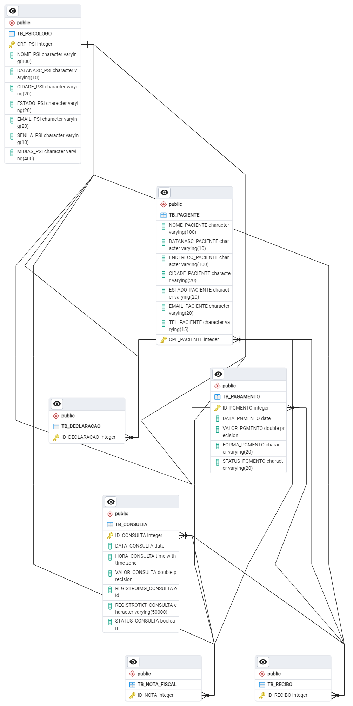

# app-agenda-psi

Com o objetivo de colocar em prática um pouco dos meus conhecimentos em UX Design e tecnologia no geral, e após conversar com alguns profissionais da área de psicologia, surgiu a ideia deste aplicativo para ajudá-los a organizar melhor a agenda de consultas.

No aplicativo, o psicólogo não só poderá gerenciar a sua agenda de consultas, como também poderá ter acesso a todo o histórico do paciente - dados pessoais e os registros de cada sessão, além de ter um melhor controle dos pagamentos, assim facilitando o seu trabalho juntando todas as informações em um só lugar. O aplicativo também será um facilitador para o psicólogo na hora de emitir recibos, notas fiscais e declarações, além do profissional também poder divulgar o seu trabalho nas mídias sociais. Foi feito o fluxograma (Figma) e o relacionamento entre as tabelas do banco de dados (PostgreSQL) para mostrar um pouco do processo.

  

  

O logotipo, que foi gerado por Inteligência Artificial, foi pensado para fazer referência a todo o processo da terapia - por isso uma lagarta se transformando em borboleta, e a cor verde do aplicativo foi escolhida por estar relacionada a saúde. Confira abaixo as telas desenvolvidas e interaja com o protótipo [aqui](https://www.figma.com/proto/OCEn9z2igK8GltfVEquoAO/PROTOTIPO_IPSI?type=design&node-id=1-2&t=xuIoG2mHDmkw7Znu-1&scaling=scale-down&page-id=0%3A1&starting-point-node-id=1%3A2&mode=design):

  

 
